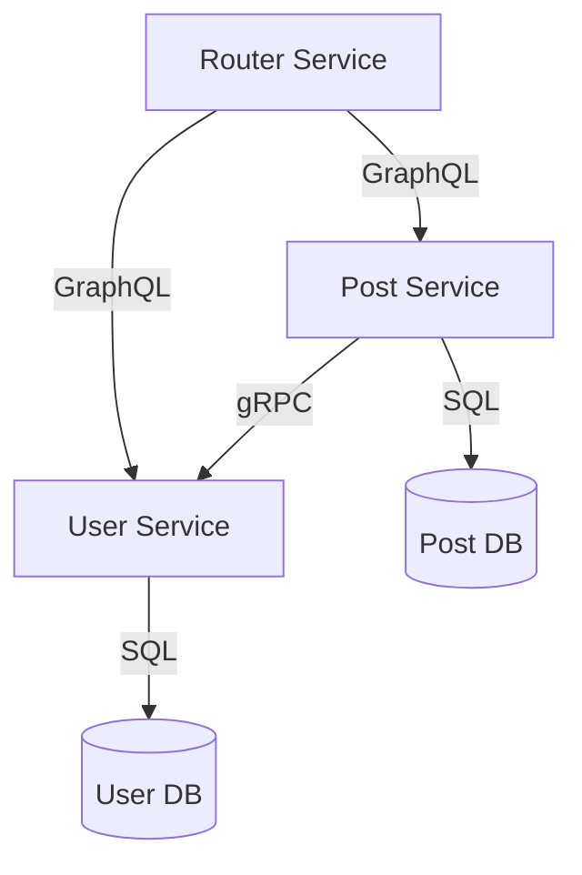

# Microservices Monorepo

This repository contains a set of microservices for a user and post management system, using GraphQL and gRPC for communication.

## Services

1. **User Service**
   - GraphQL API on port 4001
   - gRPC API on port 50051
   - PostgreSQL database on port 5433

2. **Post Service** 
   - GraphQL API on port 4002
   - PostgreSQL database on port 5434
   - Communicates with User Service via gRPC

3. **Router Service**
   - GraphQL API gateway on port 4000
   - Federates queries across User and Post services

## Prerequisites

- Docker and Docker Compose
- Node.js 16+ (for Post Service)
- Go 1.23+ (for User Service)

## Getting Started

1. Clone the repository:
   ```bash
   git clone https://github.com/hemandev/microservice.git
   cd microservice
   ```

2. Start all services:
   ```bash
   docker-compose up -d
   ```

3. Access the services:
   - User Service GraphQL Playground: http://localhost:4001
   - Post Service GraphQL Playground: http://localhost:4002
   - Router Service GraphQL Playground: http://localhost:4000

## Environment Variables

### User Service
- `DB_HOST`: Database host (default: user-db)
- `DB_PORT`: Database port (default: 5432)
- `DB_USER`: Database user (default: admin)
- `DB_PASSWORD`: Database password (default: password)
- `DB_NAME`: Database name (default: user_db)
- `GRPC_PORT`: gRPC server port (default: 50051)

### Post Service
- `DB_HOST`: Database host (default: post-db)
- `DB_PORT`: Database port (default: 5432)
- `DB_USER`: Database user (default: admin)
- `DB_PASSWORD`: Database password (default: password)
- `DB_NAME`: Database name (default: post_db)
- `USER_SERVICE_URL`: User Service gRPC endpoint (default: user-service:50051)

## Example Queries

### Create User
```graphql
mutation {
  createUser(name: "John Doe") {
    id
    name
  }
}
```

### Create Post
```graphql
mutation {
  createPost(title: "My First Post", authorId: "1") {
    id
    title
    author {
      id
      name
    }
  }
}
```

### Get User with Posts
```graphql
query {
  user(id: "1") {
    id
    name
    posts {
      id
      title
    }
  }
}
```

## Development

To rebuild and restart services:
```bash
docker-compose up -d --build
```

To view logs:
```bash
docker-compose logs -f
```

To stop all services:
```bash
docker-compose down
```

## Architecture



## License

MIT License - See LICENSE file for details
